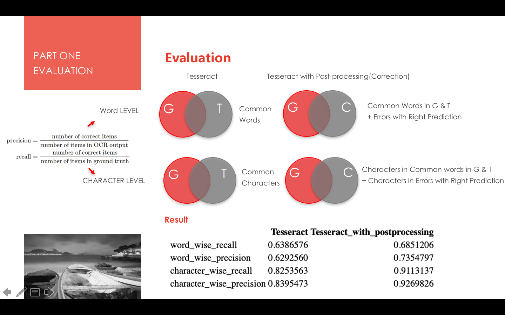

# Project: OCR (Optical Character Recognition) 


### [Full Project Description](doc/project4_desc.md)

Term: Fall 2018

+ Team #8
+ Team members
	+ Shiqing Long: sl4225
	+ Yang Yue: yy2826
	+ Yiding Xie: yx2443
	+ Yingqiao Zhang: yz3209
	
	(Names are listed in alphabetical order of last names.)
+ Paper: C2 + D1 	


**Project summary**: In this project, we created an OCR post-processing procedure to enhance Tesseract OCR output accuracy.

0. We modified `ground_truth` as `ground_truth_trimmed` since there are 13 files in the data folder with mismatching rows between `ground_truth` and `tesseract`. For more details, please refer to [README.md](data/README.md)
1. First clean the data by filtering out all punctuations. Detect Tesseract data error based on 8 rules from paper [D-1:Shortening Documents and Weeding Out Garbage ](doc/paper/D-1.pdf)
2. Locate the corresponding error words in ground truth dataset. 
  * if the number of words in corresponding row (between tesseract and ground_truth) are equal, locate the ground truth word by indexing directly
  * if the number of words in corresponding row are not equal, extract previous and following 2 words of the error word (total of 5 index), and apply string-distance function (stringdist) to locate the most likely ground truth word.
3. Select possible Candidates for errors, calculate fetures scoring for each candidate; label candidate with 1 if it equals to ground truth, else 0.
4. Performed Adaboost.R2 to predict the top 3 best matching results, and use Top 1 prediction to replace all error words. [C-2: Statistical Learning for OCR Text Correction](doc/paper/C-2.pdf) 
 

5. Evaluated OCR performance based on two formulas for both word-level and character-level:


**Custom Functions**
+ Five different functions were implemented for the purpose of this project. Detailed descriptions can be found here: [README.md](lib/README.md)

**OCR Performance Result**


+ word wise: in terms of word based accuracy.
+ character wise: in terms of letter based accuracy.
+ Tesseract: pre- process data
+ Tesseract_with_postprocessing: post- processed data, that is Tesseract with Correction.



**Contribution statement**: ([default](doc/a_note_on_contributions.md)) All team members contributed equally in all stages of this project. All team members approve our work presented in this GitHub repository including this contributions statement. 

* Shiqing Long: Assist with features scoring and model building, OCR performance evaluation, and presentation.
* Yang Yue: OCR performance evaluation, README, normalization attempt.
* Yiding Xie: Error Detection, generate all files as corpus, identify corresponding ground truth words with detected error words, partially contribute to OCR performance evaluation.
* Yingqiao Zhang: Feature scoring, select candidate, modeling, model evaluation.

Following [suggestions](http://nicercode.github.io/blog/2013-04-05-projects/) by [RICH FITZJOHN](http://nicercode.github.io/about/#Team) (@richfitz). This folder is orgarnized as follows.

```
proj/
├── lib/
├── data/
├── doc/
├── figs/
└── output/
```

Please see each subfolder for a README file.
